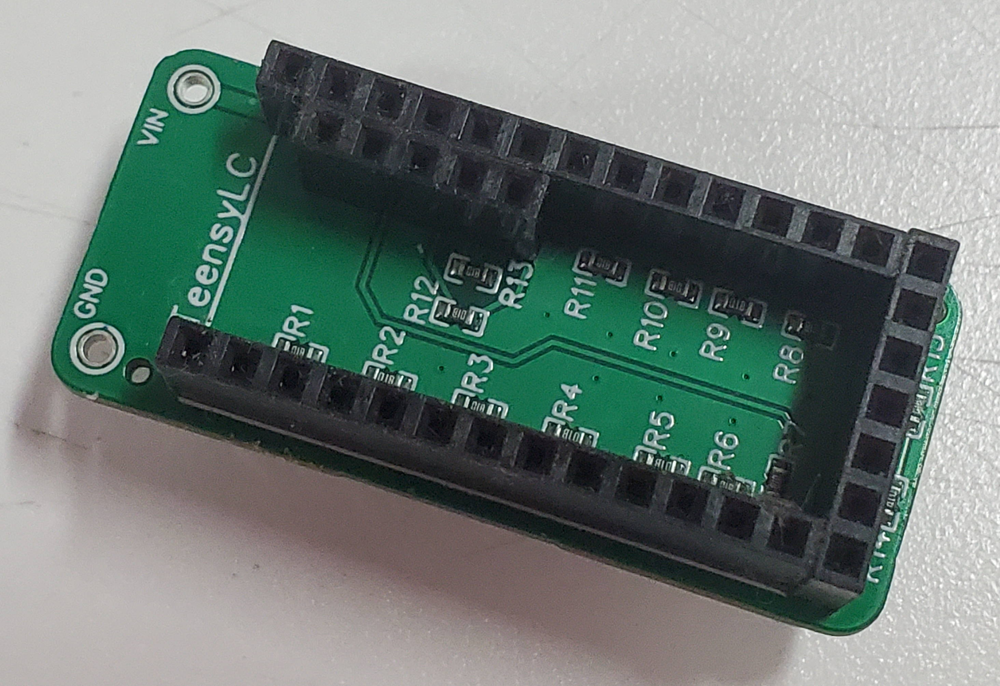

Teensy Tester
=============

Test most (not all) of the GPIO pins on a Teensy LC board. Created so I could easily check the I/O pins were working before using the Teensy LC in an important project.

This tester board basically works by grouping the Teensy LC GPIO pins into pairs and linking them together through a resistor. One pin can then be made an output and driven to a known voltage (high or low) and this output verified by reading the voltage on the other pin in the pair. The roles of the pins in the pair can then be swapped to test I/O in the other direction.

Licence
-------

Copyright © 2022 Phil Baldwin

This work is licensed under a Creative Commons Attribution-ShareAlike 4.0 International License.

You should have received a copy of the license along with this work. If not, see <http://creativecommons.org/licenses/by-sa/4.0/>.
